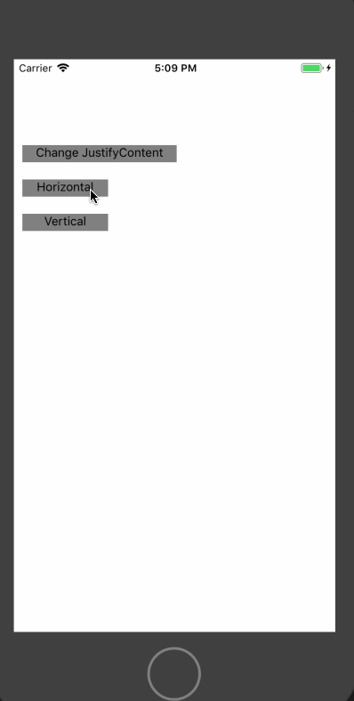
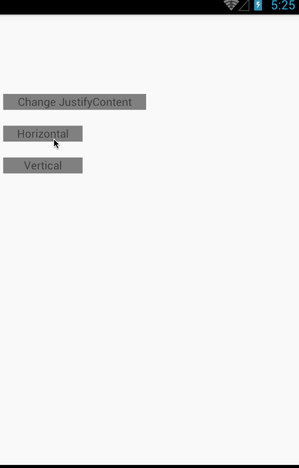

# React Native Popover

Popover component for react-native on both Android & iOS.

[](https://npmjs.org/package/rn-popover) [](https://npmjs.org/package/rn-popover) [](https://npmjs.org/package/rn-popover)

# iOS Screenshot



# Android Screenshot



# Build and run the demo

```shell
$ cd RNPopoverDemo/
$ yarn install
$ react-native run-ios
```

# Setup

#### Install:

```shell
$ yarn add rn-popover
```

#### [Demo](RNPopoverDemo/App.js)

# Props

* `style`
* `arrowSize`
* `popoverStyle`
* `popoverOrientation`
* `popoverMargin`
* `popoverSize`
* `popoverItems`
* `onRenderPopoverItem`
* `popoverItemKeyExtractor`
* `anchorView`

#### [Props Details](Popover/Popover.js#L9-L28)

# License

[MIT](LICENSE)